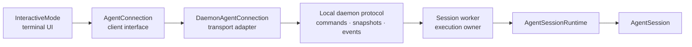

# Agent Connection Architecture

`AgentConnection` is the client-side boundary between an interactive user interface and the process that owns agent execution. It lets the terminal UI remain transport-agnostic while normal local sessions run in daemon workers.

The normal interactive path is:



Explicit fallback and embedding paths may use `InProcessAgentConnection`, but `InteractiveMode` still talks to the same interface.

`AgentConnection` is not the daemon wire protocol and is not a hosted gateway protocol. It expresses client intent in TypeScript. Each transport adapter is responsible for framing, versioning, recovery, and translation at its own boundary.

## Responsibilities

The connection exposes client operations for:

- prompting, steering, follow-up, abort, and idle waiting;
- model, service tier, thinking, transport, and queue settings;
- compaction, retry, refinement, and session navigation;
- session state, transcript, tree, context, statistics, and queues;
- model and resource catalogs;
- saved-session and import/export operations;
- serializable extension UI requests; and
- RLM child snapshots, agent messaging, schedules, and heartbeats.

The execution owner remains responsible for provider calls, tools, kernels, queues, compaction, scheduling, persistence, and RLM descendants.

## Implementations

### DaemonAgentConnection

`DaemonAgentConnection` is the standard local interactive adapter. It owns a `DaemonClient`, an active-session ID, the latest snapshot, the last event cursor, streamed snapshot assembly, and reconnect behavior.

On attach it advertises supported capabilities and receives a coherent session snapshot. Large transcripts are transferred as begin/chunk/end records. Live events carry generation-aware cursors:

```text
{ generation, sequence }
```

The adapter rejects duplicate or retired-generation events. After a transient socket loss it reconnects with the same client identity and last cursor, reattaches, and emits a resynchronized snapshot. If incremental replay is unavailable, the session snapshot is the source of truth.

A daemon hello capability is only an offer. After `attach()`, use `supportsNegotiatedCapability()` to prove that the exact request and validated attach result established an optional client capability on the current physical transport. A new attach invalidates the old public proof synchronously. Stale responses, replacement failure, shared-client capability mutation, socket replacement, and disposal cannot restore it. Correlated runtime frames that arrive before the attach result are held behind this proof and released only when the validated echo commits. The pre-proof fence has independent frame-count and cumulative structural-weight limits. The atomic chunked-replacement fence applies the same limits to its queued frames. Overflow fails closed and discards the entire fence with a fixed payload-free error. Attachment admission, route/epoch change, transport loss, disposal, or matching session close retires an old chunked fence so it cannot block a later proved route; delayed old snapshot transfers stay ignored until a fresh attachment commits.

An explicit `DaemonClient.close()` is terminal owner disposal. It wakes and stops normal or update recovery through every connection sharing the client. An already-running recovery callback cannot be cancelled, but after it returns the adapter cannot connect, attach, query restored sessions, or publish recovery events.

Key files:

- `src/modes/agent-connection/daemon-agent-connection.ts`
- `src/modes/daemon/daemon-client.ts`
- `src/modes/daemon/daemon-protocol.ts`

### InProcessAgentConnection

`InProcessAgentConnection` wraps an `AgentSessionRuntime` for SDK compatibility and explicit local fallbacks. It may access runtime and session objects because it is an adapter; the UI may not.

In-process startup can also provide `InteractiveModeLocalSessionHost` for local callback-bearing extension behavior. JavaScript functions and render callbacks never cross the generic connection boundary.

Key files:

- `src/modes/agent-connection/in-process-agent-connection.ts`
- `src/modes/interactive/interactive-mode-services.ts`

## State, Events, and Snapshots

`AgentConnectionState` is the UI's cached view of execution state. It includes the active session, model and thinking configuration, stream and compaction status, queue modes, session identity, goals, tools, and context usage.

An initial or replacement snapshot combines:

- connection state;
- transcript messages;
- session context;
- the last event sequence and cursor;
- active RLM child snapshots; and
- an in-progress assistant message when one exists.

Connection events cover session events, replacement and resynchronization snapshots, extension UI requests, connection status, and terminal closure. The adapter updates its cache before notifying the UI.

Some connection types still reuse internal `AgentMessage`, `AgentEvent`, and model types. Those are local TypeScript contracts, not promises of a stable public network schema.

## Reconnect and Replay

Reconnect and recovery use the following mechanisms:

1. Commands use a stable client ID and command ID.
2. Mutations are journaled by `clientId + commandId`.
3. Events carry a cursor with a worker generation and monotonic sequence.
4. Attach accepts a resume cursor.
5. Reconnect retries supervisor recovery for a bounded interval.
6. Attach returns replay status and a coherent snapshot, streamed in chunks when necessary.
7. The UI receives `session_resynced` after recovery.

Generation changes matter: a sequence number is only meaningful inside its generation. A client must not compare bare sequence values across worker generations.

The protocol does not promise that every historical event remains replayable. Durable session state and a fresh snapshot are the recovery baseline; replay is an optimization for the interval the server can still cover.

## Command Lifecycle and Idempotency

The public daemon protocol is JSONL-framed and currently at protocol v7. Commands may be sent in versioned envelopes containing protocol metadata, client ID, and command ID.

Mutating commands are recorded before dispatch. A repeated completed command returns its recorded result. A command known to have been received but lacking a durable result is reported as uncertain instead of being replayed blindly. Clients acknowledge durable results so old journal entries can be compacted.

The `AgentConnection` method promise is a client convenience. It should not be treated as a general accepted/running/completed remote workflow API.

## Client-Owned Session Cleanup

`DaemonAgentConnection.dispose()` performs best-effort cleanup for a client-owned session, but it deliberately does not turn cleanup failure into a disposal failure. An authoritative local host must use raw `DaemonClient` commands instead:

1. Require the supervisor-only `authoritative_owned_session_cleanup_v1` server capability.
2. Send `complete_owned_session` from the owning client and check its response.
3. If the owner connection disappears or completion is uncertain, poll `get_owned_session_cleanup` from a replacement client with the exact host-private `activeSessionId`.
4. Accept only `settled` as proof that the exact worker generation, cleanup journals, durable descriptor, and in-memory registration are absent. Treat `active`, `stopping`, a missing capability, or transport uncertainty as not cleaned up.

The query returns only `{ status: "active" | "stopping" | "settled" }`. It does not expose process IDs, worker or owner IDs, filesystem paths, tokens, descriptor contents, or diagnostics. Stock v0.8.1 does not offer this capability, so `DaemonClient` rejects the query locally without sending an unknown command. The proof applies to registrations created or durably adopted by a capable supervisor; it cannot retroactively certify a descriptorless orphan created before that supervisor observed it.

Cleanup closes and joins any admitted recovery before it can publish a successor. Concurrent completion requests for the same resident generation share one stop operation. Finalizers are keyed by process identity and stop revision, and daemon shutdown keeps registry ownership and retry services alive until every requested worker cleanup settles. Repeated shutdown commands and signals join that same drain rather than forcing an early process exit. A client-owned create rechecks owner liveness after registration, so a disconnect while daemon readiness or process launch is still pending cannot miss its cleanup timer.

## Session Replacement

New, switch, fork, import, and tree-navigation operations may replace the runtime behind an active connection. The adapter owns rebinding and emits a replacement snapshot. The UI applies the new state and transcript; it does not rewire `AgentSession` listeners directly.

When switching to a session already owned by another resident worker, a non-owned client can reattach to that active session. Client-owned headless workers do not silently transfer ownership.

## Extension UI Boundary

Daemon-owned extensions can request serializable UI operations such as select, confirm, input, editor, notification, status, widget, title, and editor-text updates. The client validates the payload and returns a serializable response.

Executable callbacks are deliberately excluded:

- tool `execute`, argument preparation, and custom renderer functions;
- extension runner callbacks;
- local completion functions; and
- session-manager or runtime objects.

Those stay inside the process that loaded the extension. Local extensions are trusted code and run with the user's process permissions.

## Local UI Services

Terminal rendering, keyboard handling, keybindings, themes, clipboard access, local credential setup, and persisted UI preferences are client concerns. They belong in `InteractiveModeUiServices` or another client service, not in the execution protocol.

The decision rule is simple: if an action changes agent execution or persisted session state, it goes through `AgentConnection`. If it changes only terminal presentation or local preference UI, it stays client-side.

## Local-Only Data

Several operations intentionally preserve local filesystem semantics, including saved-session paths and import/export paths. Do not extend these shapes into a remote API. A hosted transport should use opaque session and artifact IDs, string timestamps, and explicit upload/download handles.

## Boundary Invariants

`InteractiveMode` must not depend on:

- `AgentSessionRuntime` or `AgentSession`;
- `SessionManager`;
- daemon socket paths, clients, or command types;
- in-process execution event emitters; or
- executable runtime callbacks delivered through `AgentConnection`.

Startup code is the composition root and may know about concrete adapters, daemon startup, local settings, and fallback runtime construction.

## Testing

Focused tests enforce the boundary and recovery behavior:

- `test/interactive-mode-boundary.test.ts`
- `test/agent-connection-daemon.test.ts`
- `test/agent-connection-in-process.test.ts`
- `test/daemon-client.test.ts`
- `test/daemon-protocol.test.ts`
- `test/main-interactive-routing.test.ts`

When changing the connection or wire surface, classify the change as backward-compatible, capability-gated, or incompatible. Update protocol/schema metadata and both old-client/new-daemon and new-client/old-daemon coverage for every wire change.

## Relationship to Hosted Execution

The local boundary is suitable for another adapter, but it does not define a hosted control plane. A hosted system still needs explicit authentication, authorization, sandbox identity, artifact transfer, stable public DTOs, multi-client ownership, and network-level compatibility policy.

The durable architectural rule is narrower and already enforced: the UI can be rich and client-specific, but it cannot own agent execution.
